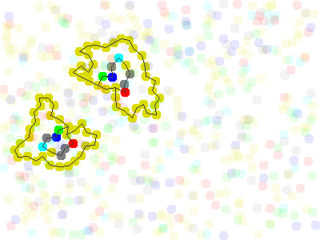

# JSquirm3

This is a java port of squirm3 by Tim Hutton. It is a simulator for an artificial chemisty. More details and the link to the accompanying paper can be found [here](https://github.com/timhutton/squirm3).

I tried to keep it as close to the original as possible. All class names are the same except for the SDL class, that I replaced with the Java Swing class for graphical output.

Screenshot:

Two cells after seperation.
